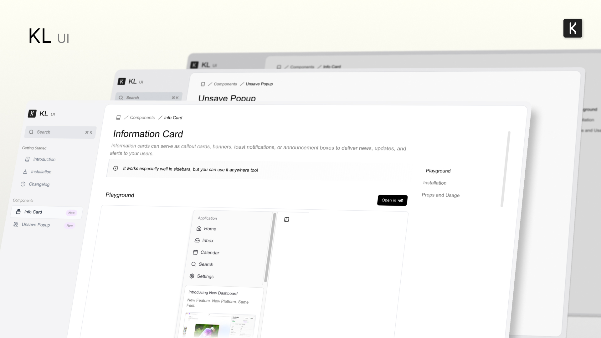

# KL UI

Beautiful animated UI components and effects built with shadcn/ui and Motion.

**Demo - [karrix.dev](https://karrix.dev)**

## Overview

Open source animated UI components and effects built with [shadcn/ui](https://ui.shadcn.com/) and [Motion](https://motion.dev/).
Feel free to use it in your projects, and share your feedback. Hope you like it!

## Contributing

Contributions are welcome! Check out our [contribution guidelines](CONTRIBUTING.md) for details on how to get started.

## License

This project is licensed under the MIT License - see the [LICENSE](LICENSE) file for details.

## Credits

Special thanks to:
- [@pqoqubbw](https://github.com/pqoqubbw) for the amazing animated icon library
- [@aidenybai](https://github.com/aidenybai) for React Scan, which helped optimize the components

## Questions?

Feel free to reach out:
- Twitter: [@karrixthediv](https://twitter.com/karrixthediv)
- Email: karrixlee1231@gmail.com